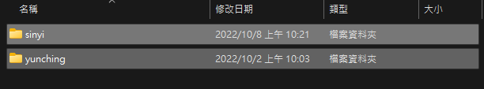
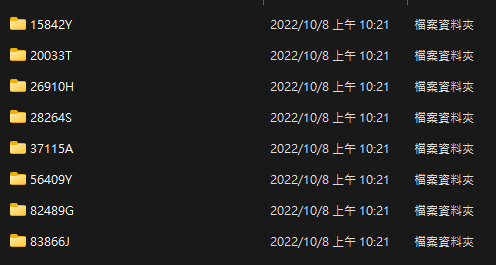

# This code is to help save house information from agents' website by Selenium + Chrome

## This code will do  
1. Save house price, name, address history
2. Screenshot each house found on the agents website  

## Installation
The code is tested by R107 chrome + chromedriver + py 3.8
1. Install [chromedriver](https://chromedriver.chromium.org/downloads). I tested R107 version + py 3.8 
2. set the path of chromedrivr in config.json  
3. pip install -r requirements.txt
4. install mongodb and create db called house and collection called house_hist

## Change website to save data you need
Simply change websites link, in all_agents list in main.py

## Execution
1. Simply python main.py

## Result
  

